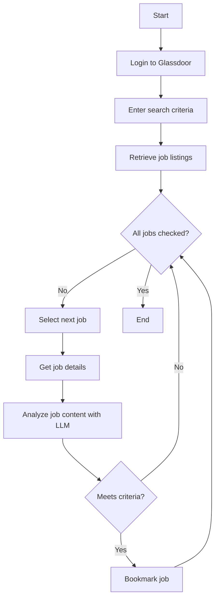

# Glassdoor Job Scraper

## Overview

This project is a Python application designed to automatically scrape and analyze internship job listings from Glassdoor based on specific criteria. It filters job opportunities according to the user's qualifications and interests, and bookmarks suitable job listings.

## Acknowledgements

This project was inspired by and built upon the concepts from the [LinkedIn-GPT-EasyApplyBot](https://github.com/JorgeFrias/LinkedIn-GPT-EasyApplyBot) project. While our implementation focuses on Glassdoor and uses different technologies, we appreciate the innovative approach of the original project in automating job applications using AI.

## Demo


## Key Features

1. Automated login to Glassdoor
2. Job search using specified criteria
3. Scrolling through job listings and retrieving detailed job information
4. Job content analysis using Groq's LLM (Llama 3.1 70B)
5. Bookmarking jobs that match the user's profile
6. Saving processed job IDs to avoid duplicate processing

## Requirements

- Python 3.7 or higher
- selenium
- seleniumbase
- langchain_groq
- python-dotenv
- pathlib
- time
- json
- os

## Technologies Used
### Why SeleniumBase instead of Selenium?

[SeleniumBase](https://seleniumbase.io/) was chosen over standard Selenium for two main reasons:

1. **Anti-scraping Bypass**: 
   SeleniumBase is more effective at bypassing anti-scraping measures implemented by websites. This makes it less likely to be blocked during web scraping operations, ensuring more reliable data collection.

2. **Simplified Syntax**: 
   SeleniumBase offers a more streamlined syntax compared to standard Selenium. This results in:
   - Cleaner, more readable code
   - Reduced boilerplate
   - Easier maintenance of automation scripts

These advantages make SeleniumBase an ideal choice for robust and efficient web scraping projects.

### Why Groq and LLaMA models?

We chose [Groq](https://groq.com/)'s LLM implementation of [LLaMA](https://ai.meta.com/blog/large-language-model-llama-meta-ai/) models for our project due to several key advantages:

1. **Cost-Efficiency**: Groq offers a generous free tier with high API call limits, making it more economical compared to OpenAI's paid plans.

2. **Performance**: The LLaMA 70B models (both 3 and 3.1 versions) provide sufficient capability for our job description analysis tasks. Smaller models (e.g., 8B) were found to be inadequate for our needs.

3. **Speed and Customization**: Groq's implementation offers fast inference and flexible prompt customization through the `langchain_groq` library, which is crucial for real-time job posting analysis.

This combination of cost-effectiveness, performance, and flexibility makes Groq's LLaMA models an ideal choice for our application, enabling efficient and accurate job suitability assessments.


## Installation

1. Clone the repository:
   ```
   git clone https://github.com/yourusername/glassdoor-job-scraper.git
   ```

2. Install the required packages:
   ```
   pip install -r requirements.txt
   ```

3. Create a `.env` file and set the following environment variables:
   ```
   GROQ_API_KEY=your_groq_api_key
   EMAIL_GLASSDOOR=your_glassdoor_email
   PASSWORD_GLASSDOOR=your_glassdoor_password
   ```

## Usage

1. Run the script:
   ```
   python main.py
   ```

2. The script will automatically log in to Glassdoor, search for jobs based on the specified criteria, and bookmark suitable job listings.

**Important Note**: 
When running this application, it is strongly recommended to use a large display. Small displays, such as those on some laptops, may cause issues with element detection and interaction. Using a larger screen will help ensure that all web elements are properly visible and accessible to the automation script, reducing the likelihood of errors during execution.

## Process Flow

The following Mermaid diagram illustrates the main process flow of the application:



## Key Components

1. **Login Function**: Uses the `login()` function for automatic login to Glassdoor.

2. **Search Function**: Utilizes the `search()` function to search for jobs using specified criteria.

3. **Job Filtering**: The `filter_jobs()` function scrolls through job listings and retrieves job details.

4. **LLM Analysis**: Uses `groq_chatmodel_if()`, `groq_chatmodel_coding()`, and `groq_chatmodel_myskills()` functions to analyze job content.

5. **Bookmarking**: The `click_bookmark_button()` function bookmarks suitable jobs.

6. **Duplicate Prevention**: Manages processed job IDs using `load_job_ids_from_json()` and `save_job_ids_to_json()` functions.


## Future Enhancements

### Integration with [Multion](https://www.multion.ai/) for Advanced Application Automation

We plan to integrate Multion, an AI-powered browser automation service, to enhance our application process:

1. **Automated Navigation to Company Websites**: 
   After identifying suitable job listings on Glassdoor, Multion will automatically navigate to the company's official website.

2. **Prompt-Driven Application Process**:
   Using natural language prompts, Multion will guide the automation through various application steps on company websites, such as:
   - Locating the careers or job application page
   - Filling out application forms
   - Answering screening questions

3. **Adaptive Interaction**:
   Multion's AI capabilities will allow the system to adapt to different website layouts and application processes, making it more versatile than traditional web scraping tools.

4. **Overcoming Current Limitations**:
   As of August 2024, Multion doesn't support file uploads. We plan to develop workarounds when necessary.

This enhancement aims to streamline the entire job application process, from job discovery on Glassdoor to submitting applications on individual company websites, all through AI-driven automation.

**Note**: We are committed to using this technology responsibly and in compliance with each website's terms of service and ethical web interaction guidelines.

### Transition to Text-Based Element Selection

To improve the robustness and longevity of our scraping logic, we're planning to transition from class/ID-based element selection to text-based selection.

 **Example Transition**:
Current approach:
```python
   driver.find_element("css selector", "button[class*='BookmarkButton_buttonWrapper']")
```
Proposed approach:
```python
driver.find_element("xpath", "//button[contains(text(), 'Bookmark') or contains(@aria-label, 'Bookmark')]")
```

## Disclaimer

This script is created for educational purposes only. Web scraping may be against the terms of service of some websites. The author does not endorse or encourage any illegal scraping activities. Users are responsible for ensuring they comply with Glassdoor's terms of service and any applicable laws when using this script. Always use web scraping tools responsibly and ethically.


## License

This project is released under the [MIT License](https://opensource.org/licenses/MIT).

## Contributing

We welcome collaboration from fellow engineers and organizations who are interested in advancing this project. If you're passionate about job search automation, AI integration, or web scraping technologies, we'd love to work with you!

## Author

Haruta Uchino


